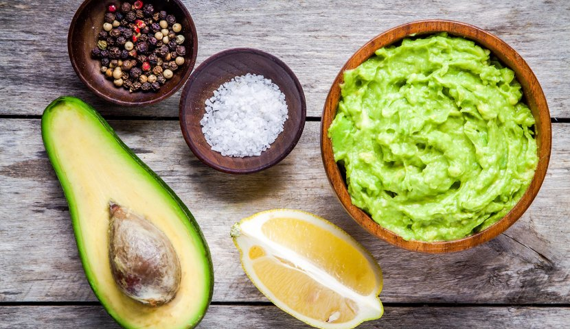

# Мой Рецепт гуакамоле

## Ингредиенты:

```python
- 2 спелых авокадо
- 1 средний помидор
- 1/2 красного лука
- 1 зубчик чеснока
- 1 лайм
- свежая зелень (кинза или петрушка)
- соль и перец по вкусу
```


## Инструкции:

1. Разрежьте авокадо вдоль и удалите косточки. Выньте мякоть ложкой и поместите ее в миску.
2. Разомните авокадо вилкой, чтобы получить текстуру пюре.
3. Нарежьте помидор и лук на мелкие кубики и добавьте в миску с авокадо.
4. Добавьте измельченный зубчик чеснока и нарезанную зелень.
5. Выжмите сок лайма и добавьте его в миску.
6. Посолите и поперчите по вкусу, перемешайте все ингредиенты до однородной массы.
7. Подавайте с тортильями или чипсами.

**Приятного аппетита!**

